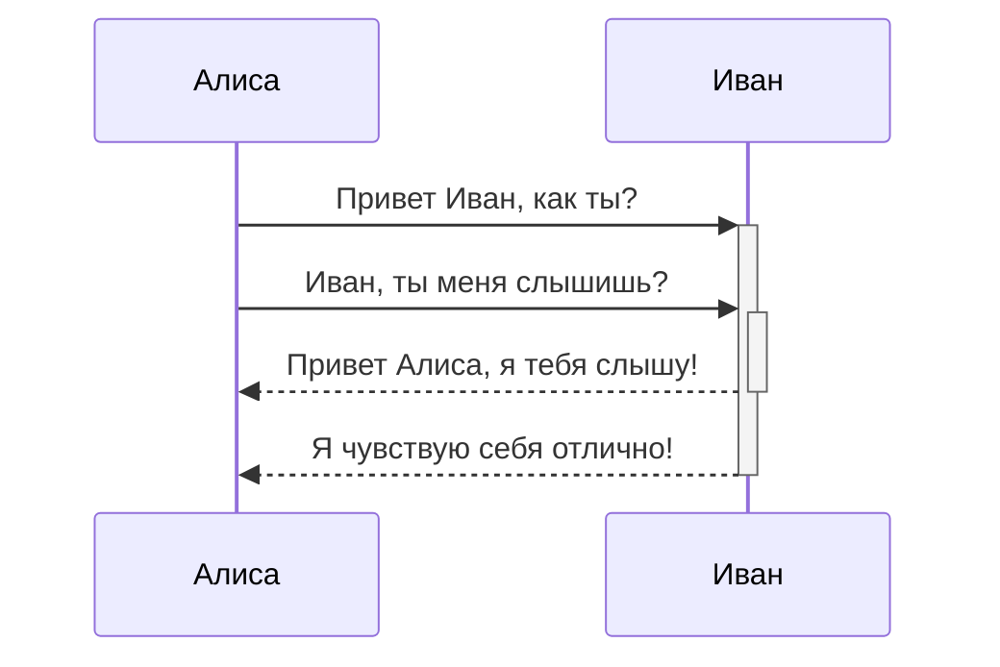
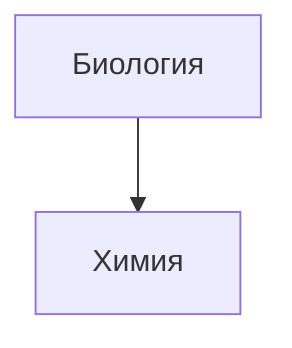

* [Возможности Markdown в Obsidian](https://publish.obsidian.md/help-ru/Руководства/Форматирование+заметок) - полная статья по тому, что представлено ниже;
* https://commonmark.org/help/
___
### Вложенные файлы
![[Василий Тёркин#Связанные воспоминания]]

### Цитирование
> Люди сталкиваются со всё более сложными и неотложными проблемами, и их эффективность в решении этих проблем имеет решающее значение для стабильности и дальнейшего прогресса общества.

\- Дуглас Энгельбарт, 1961

### Блоки кода
```js
function fancyAlert(arg) {
  if(arg) {
    $.facebox({div:'#foo'})
  }
}
```

### Список задач
- [x] поддерживаются #теги, [ссылки](), **форматирование**
- [x] используется синтаксис списка (поддерживаются упорядоченный или не упорядоченный списки)
- [x] это завершенная задача
- [?] это тоже завершенная задача (работает с любым символом)
- [ ] это незавершенная задача
- [ ] задачи в области предварительного просмотра помечаются завершенными при нажатии на чекбокс

### Таблицы
| Первый заголовок          | Второй заголовок          |
| ------------------------- | ------------------------- |
| Первый заголовок          | Содержимое второй ячейки  |
| Содержимое первой колонки | Содержимое второй колонки |

В таблицах поддерживается выравнивание | Пример выравнивания
:------------|------------:
по краю с использованием двоеточия `:` | по правому краю

| Первый заголовок           | Второй заголовок                   |
| -------------------------- | ---------------------------------- |
| [[Василий Тёркин\|Тёркин]] | [[Горячие клавиши]]]] |
### Зачеркивание
Любой текст заключенный в двойные тильды (например, ~~так~~) будет отображаться как зачеркнутый.

### Сноски
Пример простой сноски[^1] и пример сноски подлиннее[^большая_сноска].

[^1]: со смыслом!

[^большая_сноска]: с несколькими абзацами и кодом.
	
	Делайте отступ перед абзацем, чтобы включить его в сноску.
	
	`{ мой код }`
	
	Абзацев может быть сколько угодно.

Сноски также можно оставлять прямо в тексте.^[обратите внимание, что карет `^` при этом выносится за скобки.]

### Комментарии
Комментарий внутри текста: %%скрытый комментарий%% (который, не виден в режиме предварительного просмотра)

Скрытый блок с комментариями: (который, так же не виден в режиме предварительного просмотра)
%%
Он может содержать
множество строк
%%

### Диаграммы
Obsidian использует библиотеку [Mermaid](https://mermaid-js.github.io/) для отображения диаграмм и схем. У Mermaid есть удобный [«живой редактор»](https://mermaid-js.github.io/mermaid-live-editor).






